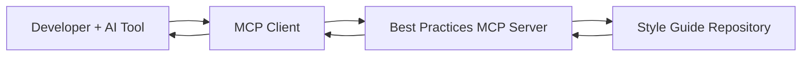

# Best Practices MCP - Centralized Coding Guidelines POC

## Overview

Best Practices MCP is a **Proof of Concept (POC)** that demonstrates how to provide centralized best practice guidelines to AI code generation tools like GitHub Copilot using the **Model Context Protocol (MCP)**. 

This project showcases how development teams can maintain consistent coding standards across projects by creating a central repository of style guides and coding practices that AI assistants can reference during code generation.

## The Problem

When using AI code generation tools across multiple projects or team members, maintaining consistent coding standards becomes challenging because:

- Each developer may have different coding preferences
- AI tools lack context about team-specific conventions
- Style guides are often documented separately and not integrated into the development workflow
- Code reviews become focused on style rather than logic and architecture

## The Solution

Best Practices MCP demonstrates how to solve this by:

1. **Centralizing Guidelines**: Creating a single source of truth for coding standards
2. **MCP Integration**: Using the Model Context Protocol to make guidelines accessible to AI tools
3. **Real-time Access**: Enabling AI assistants to query best practices during code generation
4. **Team Consistency**: Ensuring all team members and AI tools follow the same conventions

## How It Works

1. **Developer** requests code generation from an AI tool (e.g., GitHub Copilot)
2. **AI Tool** queries the MCP server for relevant coding guidelines
3. **MCP Server** retrieves appropriate best practices from the central repository
4. **Guidelines** are provided as context to inform code generation
5. **Generated Code** follows team standards automatically

## Key Benefits

- **🎯 Consistency**: All generated code follows the same standards
- **⚡ Real-time**: Guidelines are applied during generation, not after
- **🔄 Centralized**: One place to update standards for all projects
- **🤖 AI-Friendly**: Works seamlessly with existing AI development tools
- **📈 Scalable**: Easy to add new guidelines and extend to new projects

## License

MIT License - see [LICENSE](LICENSE) for details.

---

**Note**: This is a proof of concept project. Production use should include additional security, error handling, and performance considerations.
